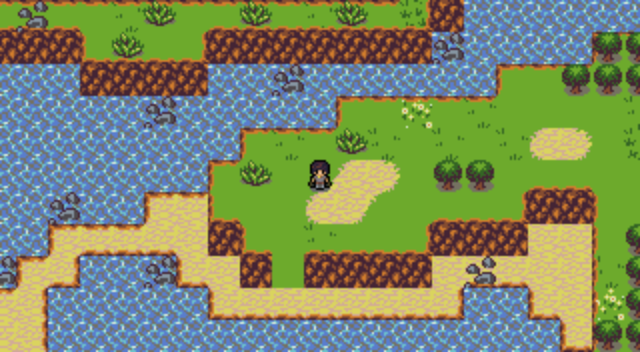

# Coric's Quest

*Coric's Quest* is a small, complete 2D fantasy-themed console-style RPG, made with Rust and Miniquad.
Guide the intrepid hero Coric through a land thrown into chaos, once watched over by the Elemental Spirits, now possessed by a mysterious darkness.

 - Play on itch.io: <https://tungtn.itch.io/corics-quest>
 - Homepage: <https://tung.github.io/corics-quest/>

## Features

 - Three realms to explore, each with their own dungeon and boss to defeat.
 - One-on-one turn-based battle system.
 - Twenty-four types of enemies.
 - Four weapons and armors.
 - Four magic spells.
 - Four kinds of consumable items.
 - Several simple puzzle mechanics.

## How to Play

 - **Arrow keys**: Walk around, move the cursor in menus.
 - **Space**: Talk/interact, confirm in menus.
 - **Left Ctrl**: Bring up main menu, cancel in menus.

*Coric's Quest* can be played natively on Windows and Linux, and in a web browser thanks to WebAssembly.

The Linux native build requires `libasound2`, as well as `glibc` version 2.34; the game is tested on Debian 12, though it should also run on Ubuntu 21.10 and newer.

Save data and options are stored in a file named `local.data` for native builds in the current directory, usually the same place as the executable, and as LocalStorage for the web browser version.

## Foreword

*Coric's Quest*, though small in scope, is styled after the kind of RPGs that were common to the video game consoles of the 80s and 90s.
It's a throw-back to the simple joys of exploring, finding treasure, fighting monsters and watching numbers go up.

The game is written in Rust, whose strong type system made refactoring code for changes and additions relatively painless.
Its lifetime system prevented the kinds of "lurking landmine" issues that tend to crop up in C++ code bases, like iterator invalidation.
Async functions were easy to set up and made directing high-level logic a breeze compared to hand-rolled state machines or full-blown scripting language bindings.

I went with Miniquad as my game framework of choice.
This makes the final file size small, which is good for players.
This also makes build times fairly short, which is good for me.

The game has very few entities, so there's no need for an entity component system.
It also does most of its work on a single thread, which cuts out a lot of complexity and overhead.
The end result is native builds with almost negligible CPU and memory usage.

You may have noticed that the game is open source.
I'm happy with the high-level architecture of the code, but there's also a lot that's ad-hoc, hard-coded and poorly-commented.
I prioritized finishing the game over endless refactoring, which I think was the right call for a solo project like this.
I hope this inspires people to create their own take on a game like this, or that it at least serves as a useful learning resource for aspiring game developers.

## Version History

### 1.0.1

Fix missing tile collision flags that could let the player walk to unintended places and possibly get stuck.

### 1.0.0

Initial release.

## Attribution

*Coric's Quest* is written in [Rust][rust] using the following helper libraries:

 - Miniquad: <https://github.com/not-fl3/miniquad>
 - quad-snd: <https://github.com/not-fl3/quad-snd>
 - quad-storage: <https://github.com/optozorax/quad-storage>
 - miniserde: <https://github.com/dtolnay/miniserde>
 - png: <https://github.com/image-rs/image-png>

Most of the assets were made by other people under one or more of the following licenses:

 - CC-BY 3.0: <https://creativecommons.org/licenses/by/3.0/>
 - CC-BY 4.0: <https://creativecommons.org/licenses/by/4.0/>
 - OGA-BY 3.0: <https://static.opengameart.org/OGA-BY-3.0.txt>

Tileset, character templates and title font are from the ["Tiny 16: Basic" tileset][tiny-16] by Lanea Zimmerman, licensed CC-BY 4.0 / CC-BY 3.0 (with anti-DRM clause waived) / OGA-BY 3.0.
Modifications: character sprites based on templates, bookcase tiles and two-tile-wide drawers; ice tile added.

Enemy artwork is by [David E. Gervais][gervais], licensed CC-BY 3.0.
Modifications: Air Spirit sprite, combined from two existing sprites with touched-up pixels.

Music is from ["Generic 8-bit JRPG Soundtrack"][generic-8-bit-jrpg] by Avgvsta, licensed CC-BY 4.0 / CC-BY 3.0 / OGA 3.0.

Boss battle theme is from ["JRPG Collection 2"][jrpg-collection-2] by Yubatake, licensed CC-BY 3.0.
Modifications: music cropped for length.

Level gain sound is from ["JRPG Collection"][jrpg-collection] by Yubatake, licensed CC-BY 3.0.
Modifications: music sped up and cropped for length.

[rust]: https://www.rust-lang.org/
[tiny-16]: https://opengameart.org/content/tiny-16-basic
[gervais]: http://pousse.rapiere.free.fr/tome/
[generic-8-bit-jrpg]: https://opengameart.org/content/generic-8-bit-jrpg-soundtrack
[jrpg-collection-2]: https://opengameart.org/content/jrpg-collection-2
[jrpg-collection]: https://opengameart.org/content/jrpg-collection
